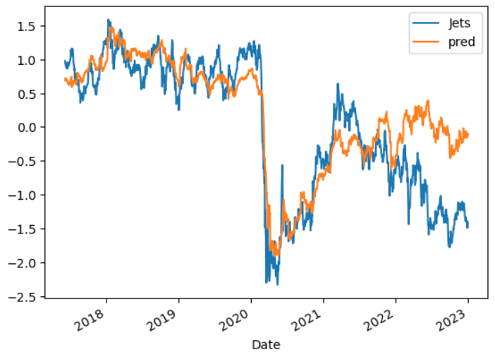
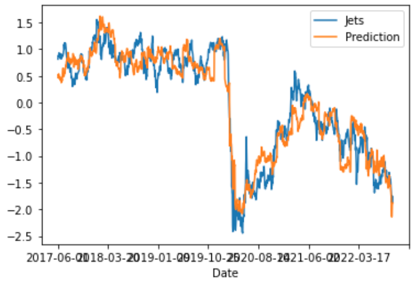
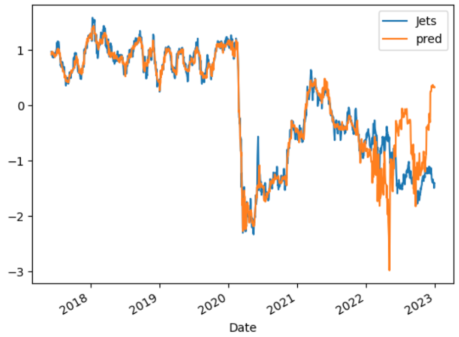

# Project_2
### Ethan, Eyob, and Jose

## Backstory: 
* We wanted to know what makes the price of equities go up and down. To get started, we chose $JETS, an ETF that provides investors access to the global airline industry.  Reason being, we felt we had a good idea as to the most pertinent factors of the airline business. For example, we thought *Oil Prices* could be inversely correlated because higher oil prices cuts into their margins. Also, we wanted to use the *DXY* because when the US Dollar is strong, people are more focused on buying food and necessities than plane tickets and luxaries.

## Describe the core message or hypothesis for your project
* We believe that we can find a strong correlation between the 'JETS' ETF price and be able to predict future price utilziing at least one of the sets of data we thought to be relevant by using machine learning models. 

## Process:
* First, we needed to get our data. To do this we used the google_data.ipynb and data_dump.ipynb files. The google_data.ipynb was used to, in the end create a dataframe that showed all of the google trend searches we wanted to use. The data_dump.ipynb was also used to create a dataframe of the DX-Y, 'JETS' ETF, and OIL prices 5 year charts. 
* After, we combined these two using the Combine_Data.ipynb. We scaled the data and then copied the dataframe to create a 'lagged' dataframe too. We also created new CSV files for these dataframes to be easily called in a fresh notebook.
* Next, it was time to feed our data to our machine learning models. To start, we chose to use the Ridge Regression and Linear Regression models. After viewing these two plotted out, they were nearly identical. This is because the Ridge is the same as the Linear except you can input one variable, which is the alpha variable (using Linear_Regression.ipynb and Ridge_Regression.ipynb). 

* Since these were one in the same, we decided to also try a deep learning model, a model that has more variables we can tweak which will hopefully yield us a different result. This neural network model did in fact give us a different result which we were happy with (Deep_Learning_Model.ipynb).

## Concluding Remarks:
* We would conclude that although our predictions from the models gave us the correct overall trend, they would over-compensate and exaggerate the actual value. From a trader's perspective, the data we gathered from our models could be used for swing trading or cyclical traders. Our data would not be fit for someone say, wanting to day trade or use options on JETS. We were not able to actually predict future price, which if we could have, we would be able to do something 99% of traders can not do. However, being able to accurately predict trend reversals and bottoms/tops is actually pretty useful. 

## Future:
* If we had more time, or wanted to work on this more in the future, we think we would like to see a couple more models data and then compare them all to one another. More models can never hurt and it would be interesting to see if all models shared some quality or something of that nature. Also, after we get a model we find is suitable and capable, we would create an algo-trading bot that takes inputs from our model's predictions. 